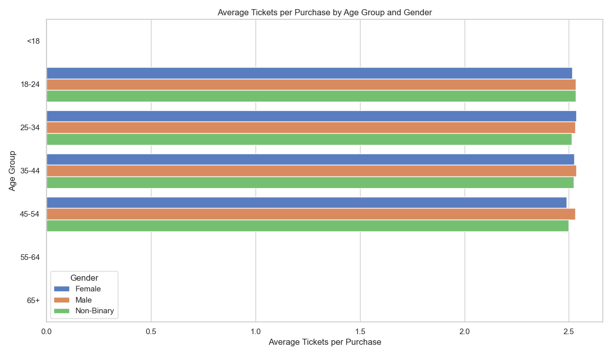
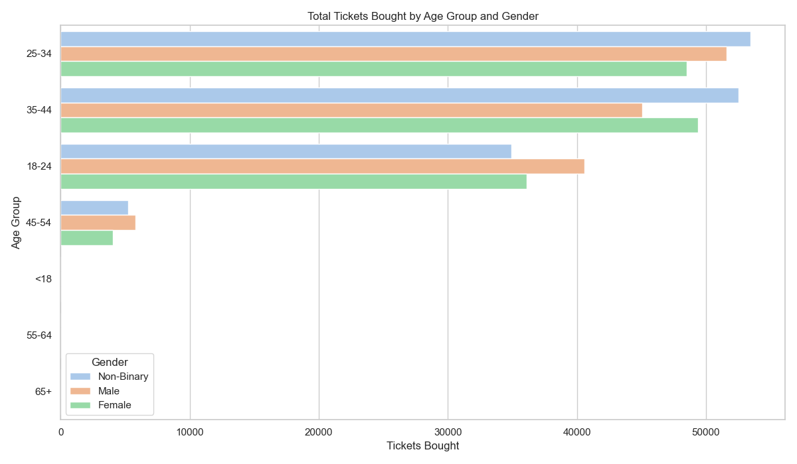
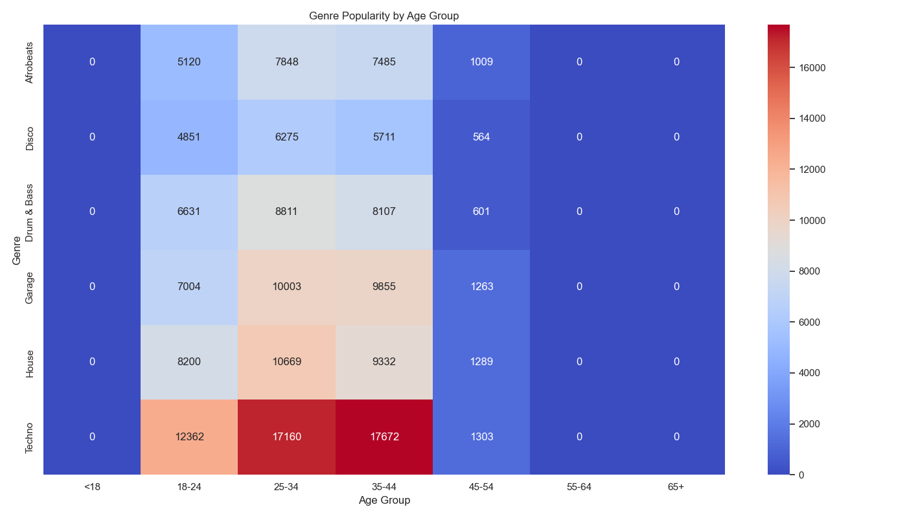
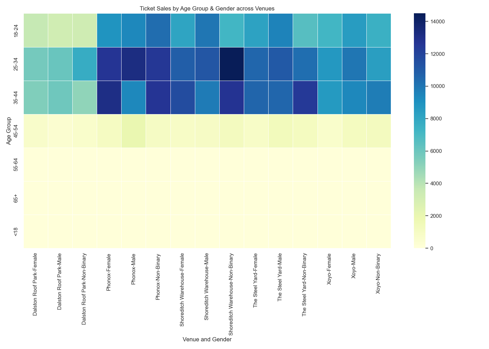

# LONDON_NIGHTLIFE Data Analysis Project

## Project Motivation
Inspired by my experiences attending events at iconic East London venues like Shoreditch Hall and Phonox, I wanted to explore how venues can better understand their audiences.  
At the heart of every great show is the audience — who they are, how they attend, and what experiences they seek.  
This project aims to analyze ticket sales and attendance patterns to uncover those stories.

I focused on answering questions such as:
- Who buys tickets in large quantities and might be VIP or group customers?
- Who tends to attend shows alone, and how can venues encourage their loyalty (e.g., free tickets for next solo visit)?
- How do demographics like age, gender, and location influence attendance by genre and venue?
- What creative loyalty strategies could venues offer based on data insights?

## Project Summary
This project explores patterns in ticket purchases, genre preferences, and venue attendance based on demographic factors like age and gender.

Visual insights reveal:
- Consistent purchase behavior across demographics  
- Strong age-based genre affinities (with Techno and House dominating)  
- Clear hotspots in venue attendance across core age groups  

These insights can support more targeted marketing, programming, and event logistics for venues looking to deeply understand their audiences.

---

## Project Visuals

### Average Tickets per Purchase

### Total Tickets by Demographics

### Genre Popularity by Age Group

### Venue Ticket Sales Heatmap

---

## Visual Insight Summaries

### 1. Average Tickets per Purchase by Age Group and Gender
**Insight**: Ticket purchasing behavior is relatively consistent across age and gender groups, averaging just over 2.5 tickets per transaction.  

**Why it matters**:  
This suggests group size during bookings is stable regardless of demographic. It helps validate consistent pricing strategies or ticket bundle offers without needing heavy segmentation.

---

### 2. Genre Popularity by Age Group
**Insight**: Techno and House are significantly more popular among the 25–44 age range, while genres like Disco and Afrobeats see moderate engagement. Almost no engagement is recorded from users under 18 or over 55.  

**Why it matters**:  
This highlights strong age-based genre preferences. Event curators, DJs, or marketers can tailor lineups and marketing to age-specific tastes, especially promoting Techno to the 25–44 segment.

---

### 3. Ticket Sales by Age Group and Gender across Venues
**Insight**: Venues like Shoreditch Warehouse and Phonox attract high ticket sales from the 25–44 age group across all genders. The 18–24 segment also shows strong engagement.  

**Why it matters**:  
It reveals where each venue's audience is strongest, helping shape targeted campaigns, promotions, or even lineup curation. It also flags opportunities to grow attendance in less represented age groups.

---

## Why This Approach
To uncover meaningful insights about London’s nightlife crowd, I combined multiple datasets — events, ticket sales, and attendee demographics — into one clean, unified file using a simple merge script.  
Then, with my `insights_generator.py` script, I focused on segmenting the data by venue, age group, and gender.  
This allowed me to see which demographics visit which venues (like my favorite, Phonox), how ticket buying habits differ, and how often people attend events solo.  

By grouping, merging, and exporting clear summary files, I made it easy to spot trends in who goes out, where they go, and how they experience London’s nightlife.

---

## Folder Structure

